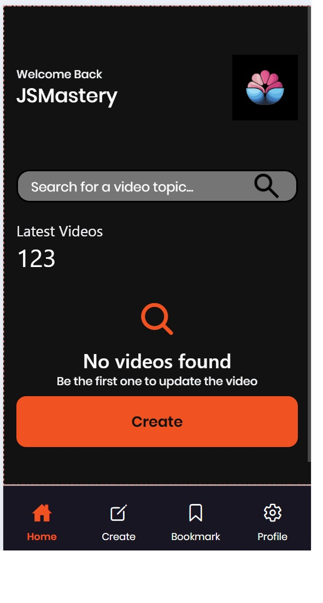

# React Native Demo

## Main Dependencies

- **Routing**: `expo-router`
- **Video Player**: `expo-av`
- **File Explorer**: `expo-document-picker`
- **Styling**: `nativewind`, `tailwindcss`
- **API Requests**: `axios`

## Creating the Application

To create the project and integrate `nativewind`, use the following command:

```bash
npx create-expo-stack@latest --nativewind
```

## Backend

The backend code for this project is located at:[Here](https://github.com/cxxyao2/HealthCenterBackend.git).

## Notes

### Regarding Routing (Router)

After creating the application, you need to modify the `package.json` file to use `expo-router`.

**Before modification**:

```json
"main": "node_modules/expo/AppEntry.js",
```

**After modification**:

```json
"main": "expo-router/entry"
```

### Regarding Tailwind CSS

My project folder structure is as follows:

```plaintext
Root directory (where the package.json file is located)
├── package.json
├── app/ (including sub - directories like tabs)
├── assets/
└── components/
```

Therefore, the content of the `tailwind.config.js` file is as follows:

```javascript
module.exports = {
  content: ['./App.{js,ts,tsx}', './app/**/*.{js,ts,tsx}', './components/*.{js,ts,tsx}'],
  // Other configurations...
};
```

If you store components in other folders, please add the paths of these folders to the `content` field.

### Behavioral Differences on Different Platforms (Android, iOS, Web)

The behavior of the same component may vary significantly across different platforms. For example, the `Alert` component may not work properly in web browsers. Therefore, I implemented a custom modal to display messages. Comprehensive testing is required on different platforms.

### Debugging Layout

You can set borders and border colors to test the layout more efficiently.

## Screenshots

- login1
  
- main feature
  
- not found
  
